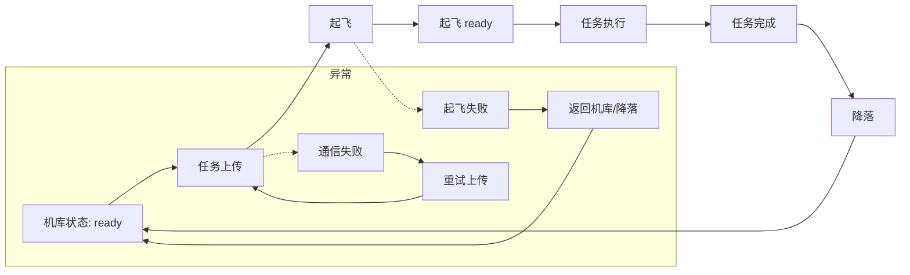

# 任务逻辑
下面的流程图表示无人机从机库准备到降落的主要状态转换（使用 Mermaid 绘制）。



简要说明：
- 机库状态: ready — 系统空闲并准备接收任务。
- 任务上传 — 地面站或调度器上传任务到无人机。
- 起飞 — 发出起飞命令并开始起飞过程。
- 起飞 ready — 起飞前的就绪确认（传感器、GPS、姿态稳定等）。
- 任务执行 — 按编辑执行任务（巡航、拍照、投放等）。
- 任务完成 — 任务达到目标条件或时间窗口结束。
- 降落 — 返回并着陆到机库或指定降落点。

飞行过程中，当电池电压低于XXV后，地面软件发送更新的回家任务，回家点是任务列表里面的HomePos，然后发送任务执行命令，飞机会执行新的回家任务，回到HomePos点，回到后会发送回到该点状态，可执行land指令，无人机降落到平台上后，发送armoff停机，开始充电，充电完成后，机库发送充电完成消息，地面站可发送打开机库，检测机库ready状态，完成后重新发送后续的轨迹点组成任务进行执行。


# 任务消息

1. 机库打开

打开机库服务MissionCommand：
```
# Request: 发送一个整型指令（例如命令编号）
int32 command  # 1 打开，2关闭

---

# Response: 返回执行状态描述
string status

```

机库充电会定时回传充电状态信息HangarChargeStatus.msg，具体信息结构如下：

```
# 机库充电状态消息
# 用于表示机库对无人机的充电处理状态

# 时间戳
std_msgs/Header header

# 充电状态码
#  0 = 待命（未充电）
#  1 = 充电中
#  2 = 充电完成
#  3 = 充电错误
#  4 = 设备离线
int32 charge_status

# 当前充电百分比 (0-100)
int32 battery_percentage

# 充电功率 (单位: W，0 表示未充电)
float32 charge_power

# 充电时长（单位：秒）
float32 charge_duration

# 错误消息（如有错误）
string error_message
```


2. 起飞
发送起飞指令，takeoffland.msg
```
uint8 TAKEOFF = 1
uint8 LAND = 2
uint8 takeoff_land_cmd
```
p_controller起飞逻辑：
	1.启动p_controller的ros节点；
	2.订阅/mavros/state话题，判断飞行模式；
	3.如果飞行模式为OFFBOARD，则根据预设起飞高度，发布控制指令/mavros/setpoint_raw/local（消息类型：mavros_msgs::PositionTarget），px4接收此topic，控制飞机起飞ma。

px4ctrl（浙大开源控制器）起飞逻辑：
	1.启动控制器节点；
	2.订阅/takeoff_land话题（消息类型：quadrotor_msgs::TakeoffLand）；
	3.若接收到quadrotor_msgs::TakeoffLand消息的takeoff_land_cmd成员的值等于1，则根据预设起飞高度，发布控制指令/mavros/setpoint_raw/attitude（消息类型：mavros_msgs::AttitudeTarget），px4接收此topic，控制飞机起飞


3. 任务上传
上传消息MissionList：
```
int32 id                     #任务id 0/1（RF_id/二维码）
geometry_msgs/PoseStamped HomePos  #起飞与返回点
int32 PosNum                 #航点数量
WaypointPosition[] PosList         #航点列表
```


4. 回传任务点
回传的任务点执行情况信息WaypointPosition：
```
float64 x
float64 y
float64 z
bool pass_type      #航点是否通过，0未通过，1通过
string task_type    #航点处需要执行的任务类型 1、代表云台向前拍摄；2、代表云台向左拍摄；3、代表云台向右拍摄；4、代表RFID收数据
string info
```

4. 降落
发送降落指令，takeoffland.msg
```
uint8 TAKEOFF = 1
uint8 LAND = 2
uint8 takeoff_land_cmd
```
px4ctrl（浙大开源控制器）降落逻辑：
	1.订阅/takeoff_land话题（消息类型：quadrotor_msgs::TakeoffLand）；
	2.若接收到quadrotor_msgs::TakeoffLand消息的takeoff_land_cmd成员的值等于2，发布控制指令/mavros/setpoint_raw/attitude（消息类型：mavros_msgs::AttitudeTarget），px4接收此topic，控制飞机降落

5. 电池电量信息
