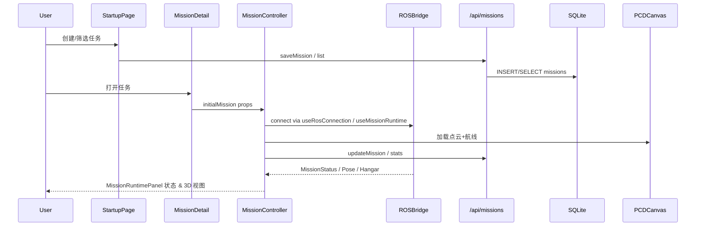

# 架构设计

## 总体架构
```mermaid
flowchart TD
    A[StartupPage<br/>任务启动页] -->|选择任务| B[MissionDetail Page]
    B --> C[MissionController]
    C --> D[PCDCanvas<br/>Three.js 渲染]
    C --> E[MissionRuntimePanel<br/>操作面板]
    C --> F[useMissionRuntime<br/>ROS Bridge]
    F -->|WebSocket| G[ROSBridge Server]
    C --> H[useMissionDatabase]
    H --> I[/api/missions Routes]
    I --> J[SQLite missions.db]
```

## 技术栈
- **前端框架:** Next.js 15 + React 19（App Router）。
- **3D 引擎:** three.js + @react-three/fiber/@react-three/drei，支持 PCD/PLY、GLTF、体素渲染。
- **实时通信:** roslib 通过 WebSocket 连接 ROSBridge；Edge runtime websocket (`/api/telemetry/ws`) 供仿真定位或回显。
- **数据访问:** better-sqlite3 DAO (`missionDao.ts`) + `useMissionDatabase` Hook。
- **UI:** Tailwind CSS 4 + shadcn/ui + Lucide 图标。

## 核心流程


## 重大架构决策
完整的ADR存储在各变更的how.md中，本章节提供索引。

| adr_id | title | date | status | affected_modules | details |
|--------|-------|------|--------|------------------|---------|
| ADR-000 | 尚无正式 ADR | - | 📝规划中 | 全局 | 待后续方案包补充 |
